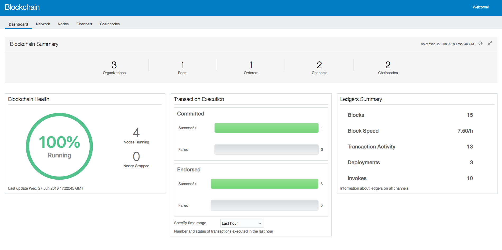
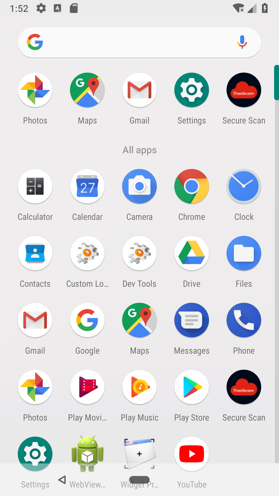
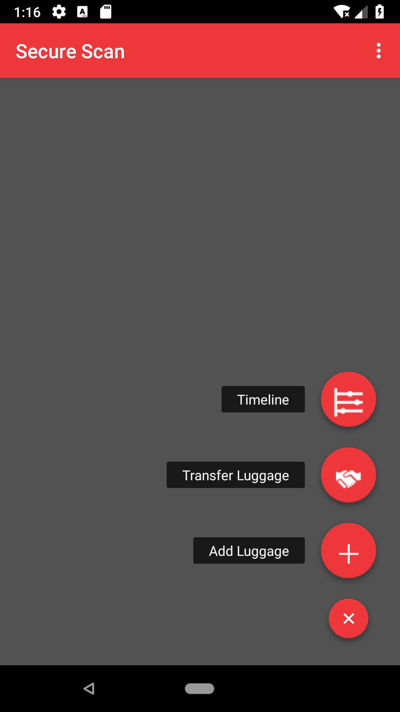
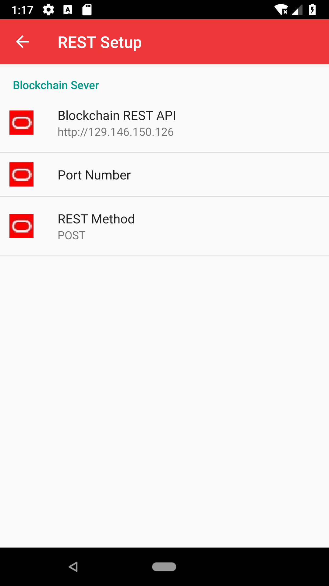
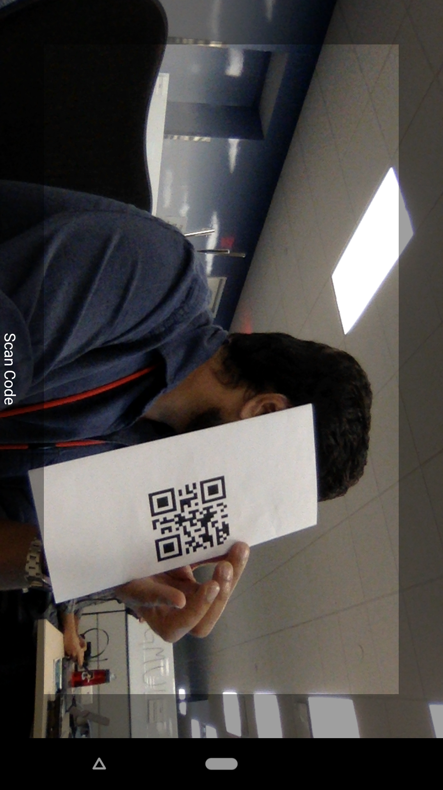
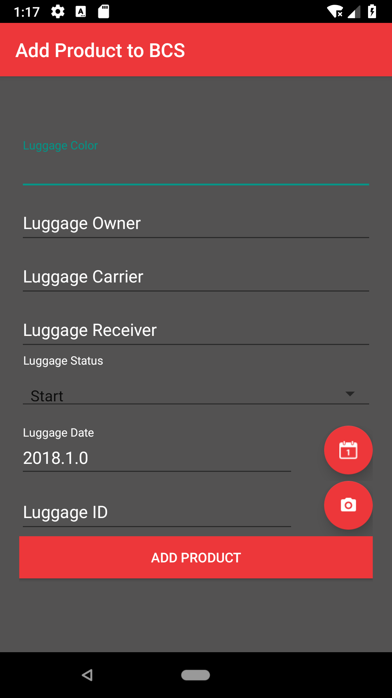
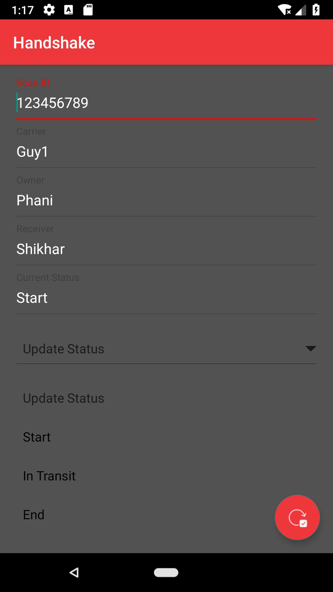
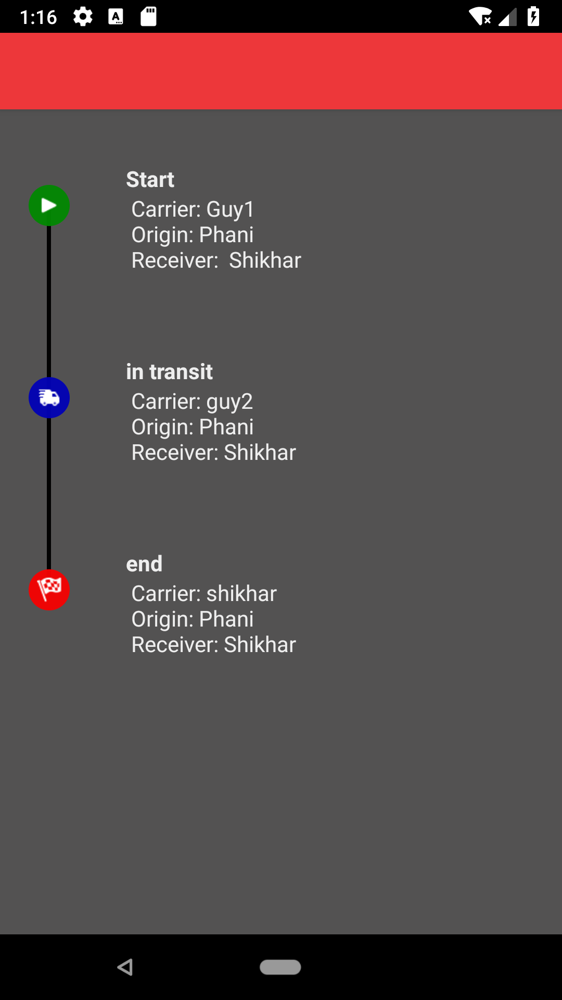

# Android App Integration with Oracle Blockchain Cloud Service
A custom android app which scans barcode of a product and can be added to Oracle blockchain cloud service. Once added it can be transferred to other in the blockchain network. Each transfer of hands can be viewed in a timeline view. 

# Oracle Blockchain Cloud Service 
A new blockchain cloud service launched by Oracle is based on Hyperledger fabric and is avaiable as service which can be instantiated once you can create a cloud account at http://www.cloud.oracle.com

# Android app built for Nexus 5

Screen | Image| Code
------------- | ------------- | -------------
Customer App Icon  |  | 
Home Screen |  |
Blockchain Setting Screen |  |
Scanner Screen |  |
Add Product Screen |  |
Transfer Screen |  |
Timeline Screen |  |

# References
1. https://hyperledger-fabric.readthedocs.io/en/release-1.1/
2. https://developer.android.com/docs/
3. https://material.io/design/

License
--------

    Copyright 2016 Phani Turlapati.

    Licensed under the Apache License, Version 2.0 (the "License");
    you may not use this file except in compliance with the License.
    You may obtain a copy of the License at

       http://www.apache.org/licenses/LICENSE-2.0

    Unless required by applicable law or agreed to in writing, software
    distributed under the License is distributed on an "AS IS" BASIS,
    WITHOUT WARRANTIES OR CONDITIONS OF ANY KIND, either express or implied.
    See the License for the specific language governing permissions and
    limitations under the License.
